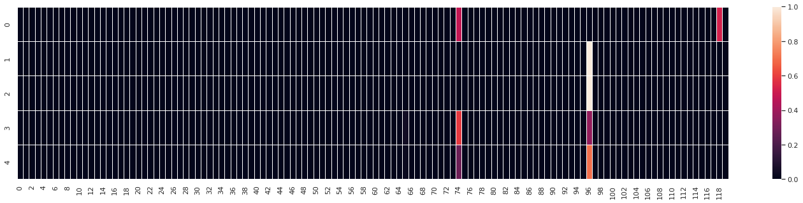
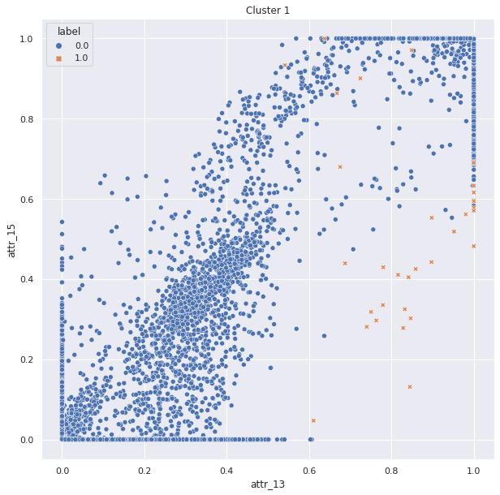
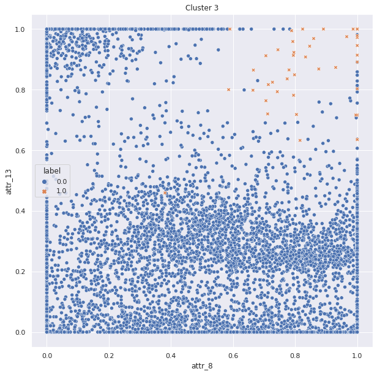
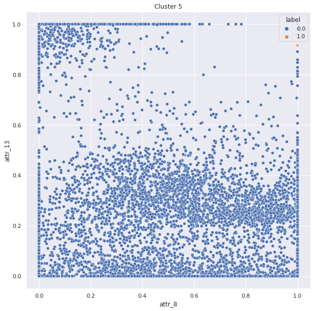
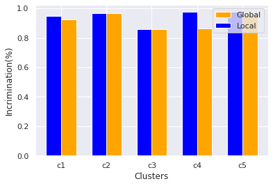
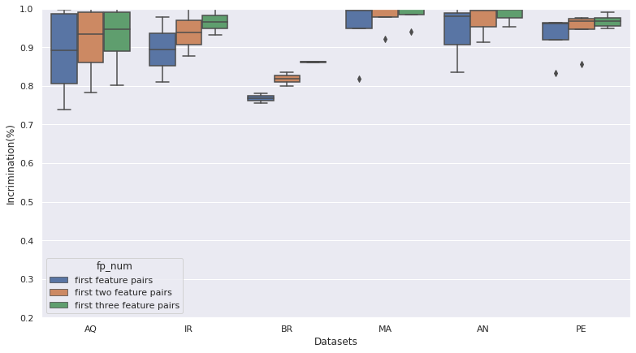

# 2021 NTUST Data Mining Final Project

Implementation of *LP-Explain_Local_Pictorial_Explanation_for_Outliers* (https://ieeexplore.ieee.org/document/9338295) in Python

## Notice( important! )

這篇paper**沒有提供source code**，這個repository為我們用python實作的結果。

另外，因論文在outlier detector 的參數設定上沒有詳細說明，所以我們復現的成果會與論文圖不太一樣，但還是能成功找到合適的feature pair來視覺化outlier。

## Usage

這篇paper提供6種資料集，下載連結如下
1. airquality ([link](https://archive.ics.uci.edu/ml/datasets/Air+quality))
2. iris ([link](https://archive.ics.uci.edu/ml/datasets/Iris))
3. annthyroid ([link](http://odds.cs.stonybrook.edu/annthyroid-dataset/)) 
4. breastw ([link](http://odds.cs.stonybrook.edu/breast-cancer-wisconsin-original-dataset/))
5. mammograph ([link](http://odds.cs.stonybrook.edu/mammography-dataset/))
6. pendigits ([link](http://odds.cs.stonybrook.edu/pendigits-dataset/))

因為程式執行需花很長時間，所以**我們有提供所有執行完成的jupyter notebook (.ipynb)。**
方便助教在裡面看過程、執行成果圖。

1. [airquality_demo.ipynb](./demo_notebooks/airquality_demo.ipynb)
2. [annthyroid_demo.ipynb](./demo_notebooks/annthyroid_demo.ipynb)
3. [breastw_demo.ipynb](./demo_notebooks/breastw_demo.ipynb)
4. [iris_demo.ipynb](./demo_notebooks/iris_demo.ipynb)
5. [mammograph_demo.ipynb](./demo_notebooks/mammograph_demo.ipynb)
6. [pendigit_demo.ipynb](./demo_notebooks/pendigit_demo.ipynb)

## Experiment result ( pendigits dataset、lambda = 3)

### Heatmap plot 

y軸為cluster數量

x軸為feature pair編號

從這張圖中挑選Weight最高的feaute pairs 

### Scatter plot

會為不同cluster的outlier，選擇不同的feature pair來解釋

### Incrimination chart (Global、Local feature pairs)

### Incrimination chart2 (six datasets)

