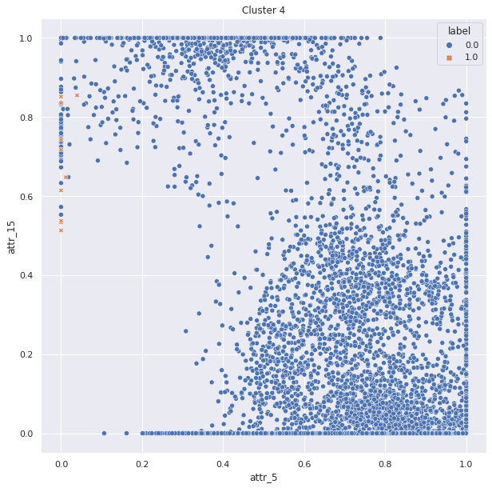

# 2021 NTUST Data Mining Final Project

Implementation of **'LP-Explain_Local_Pictorial_Explanation_for_Outliers'**(https://ieeexplore.ieee.org/document/9338295) in Python

## Notice

這篇paper**沒有提供source code**，這個reposity為我們實作的結果。

因論文的參數如何設定並沒有詳細說明，所以我們復現的成果可能會與論文圖不太一樣，但還是能成功找到feature pair來視覺化outlier。

## Usage

## Experiment setting 

## Experiment result (pendigits dataset)

### Heatmap plot ($\lambda = 3$)

This heatmap plot is used for feature pairs selection.

### Scatter plot ($\lambda = 3$)

### Incrimination chart (Global、Local feature pairs)

